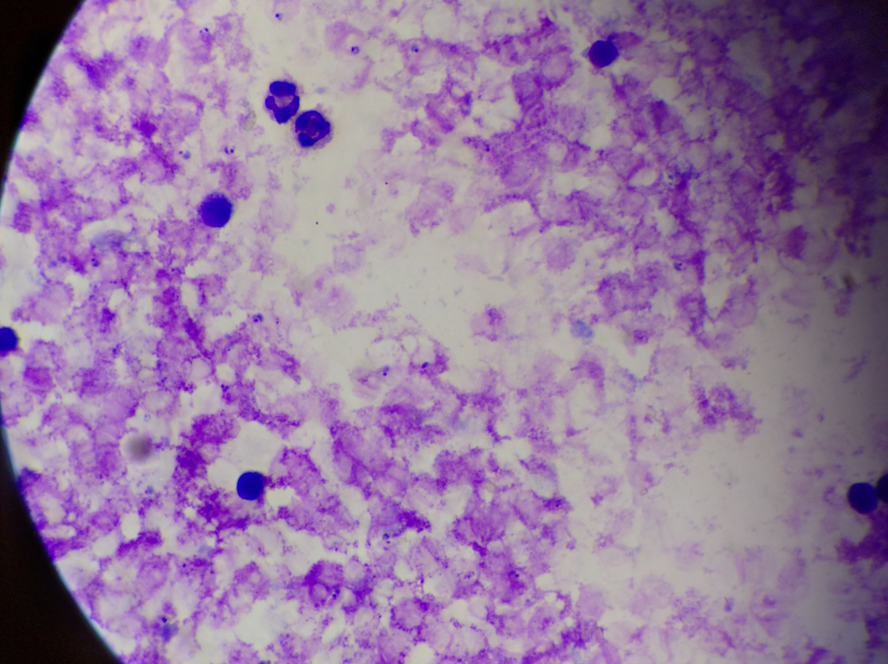
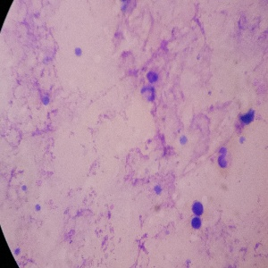
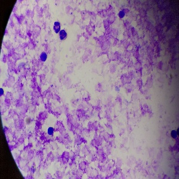
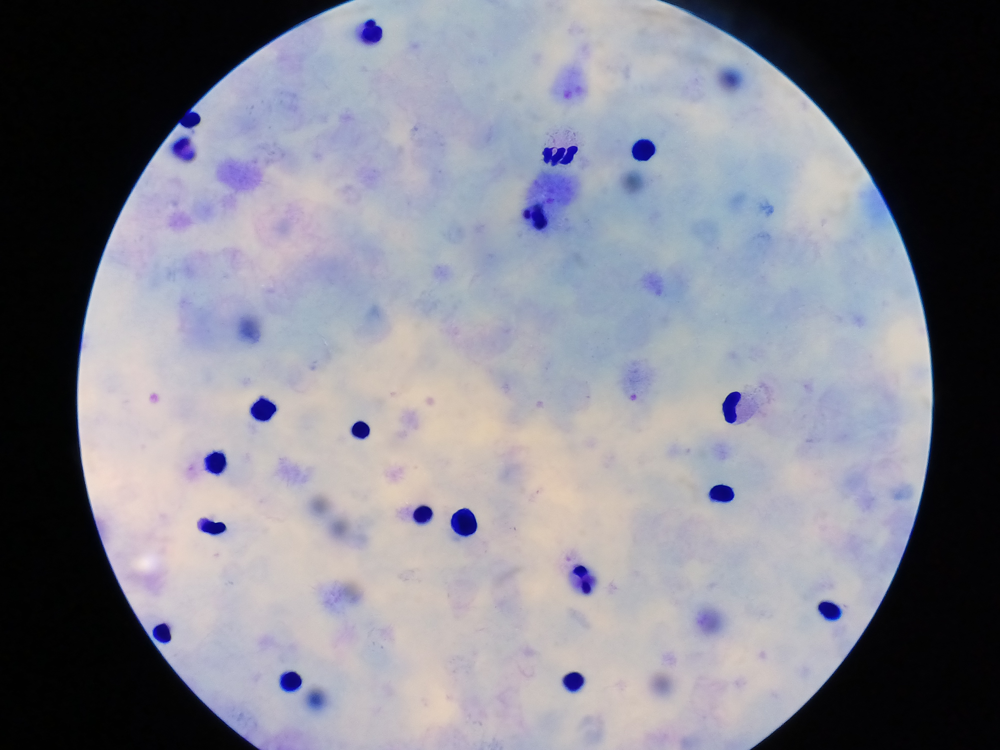
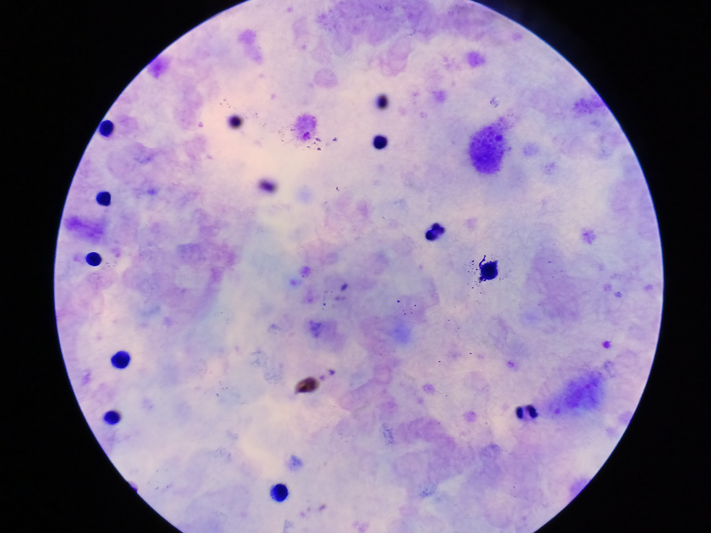
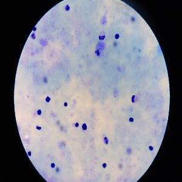

<h1>Malaria Detection in Resource Constrained Settings</h1>

  For computer vision applications, having high-quality image data with expert labeling is the gold standard. This ensures robust feature-extraction and ultimately better model performance. However, in many real-world scenarios such as malaria surveilance in sub-Saharan Africa, resources are often constrained and access to quality image-capture and computing resources is not available. In such cases, it becomes necessary to develop robust computer vision models that:
  <ol>
    <li>Can handle lower quality, inconsistent images.</li>
    <li>Are small enough to run on microcontrollers such as the STM32, while still providing reliable results in the field.</li>
  </ol>
  This approach falls under the field of TinyML, which focuses on deploying machine learning models onto resource-constrained devices.  

  <h2>The goals of this project are:</h2>
  <ul>
    <li>To train a model that can perform accurate inference on low quality images that retains reasonable accuracy when compressed (EG: into a tflite model).</li>
    <li>Develop a STM32-based PCB prototype with a LCD screen and camera.</li>
    <li>3D print a case to mount necessary hardware components.</li>
  </ul>

  With the ultimate goal of implementing a real-time image capture, inference, and display pipeline that is optimized to meet the embedded constraints.
  

<h3>Dataset:</h3>
I used the <a href="https://www.kaggle.com/datasets/rajsahu2004/lacuna-malaria-detection-dataset">Lacuna Malaria Detection Challenge Dataset</a> and the <a href="https://www.kaggle.com/datasets/cmacus/malaria-parasite-in-blood-smears">Malaria parasite in blood</a> dataset, available on Kaggle. Example images are provided below.
<h4>Trophozoite Presence (Original vs. Resized)</h4>

  </img>
  </img>

  </img>
  </img>

<h3>Negative Case (Original vs. Resized)</h3>

  </img>
  </img>

  </img>
  </img>

<h3>Model and Training (work in progress)</h3>
For this section, I opted to use EfficientNetB3 in TensorFlow, which has a 300x300 input size. [insert training / loss value graph here]

<h3>Hardware (work in progress)</h3>
I plan on using:
<ul>
  <li>STM32H7 series MCU</li>
  <li>ST7735S 180x128px LCD for display</li>
  <li>OV7670 Camera Module</li>
  <li>Cheap, disposable microscope (such as <a href="https://foldscope.com/">this)</a></li>
</ul>

